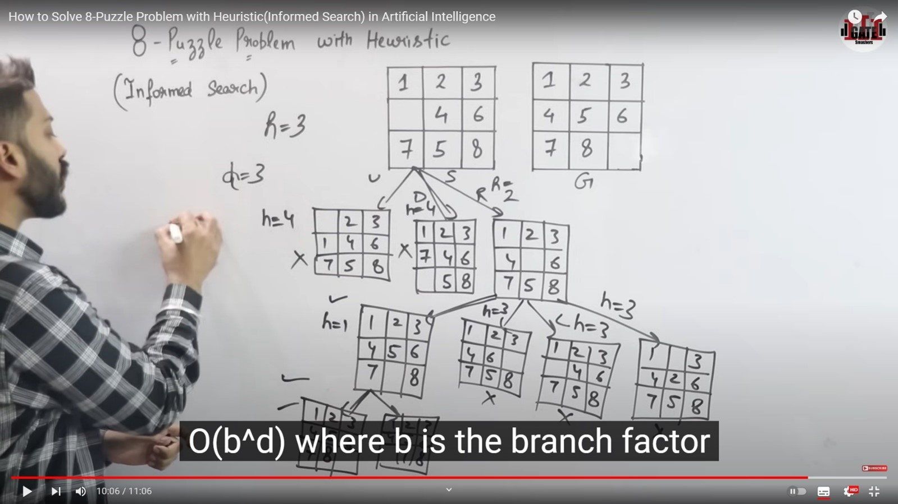

1.	Mismatched Count
R = 3{4, 5, 8이 Goal과 다른 상황}
2.	빈칸이 움직일 수 있는 부분에 대해서 계산
위 상황에서는 상, 우, 하 3방향으로 이동 가능한 상황

---

UP. 상 방향 이동 시

|   | 2 | 3 |
|---|---|---|
| 1 | 4 | 6 |
| 7 | 5 | 8 |

DOWN. 하 방향 이동 시

| 1 | 2 | 3 |
|---|---|---|
| 7 | 4 | 6 |
|   | 5 | 8 |

RGIHT. 우 방향 이동 시

| 1 | 2 | 3 |
|---|---|---|
| 4 |   | 6 |
| 7 | 5 | 8 |

---

휴리스틱을 사용하면 가장 최고의 값이 어떤 것인지 알 수 있다.
휴리스틱 값을 계산 해보겠다.

[UP. 상 방향 이동 시]: misplaced된 값의 개수: 4(공백은 세지 않는다)

|   | 2 | 3 |
|---|---|---|
| 1 | 4 | 6 |
| 7 | 5 | 8 |

[DOWN. 하 방향 이동 시]: misplaced된 값의 개수: 4

| 1 | 2 | 3 |
|---|---|---|
| 7 | 4 | 6 |
|   | 5 | 8 |

[RGIHT. 우 방향 이동 시]: misplaced된 값의 개수: 2[가장 작은 값] – 휴리스틱 결과[2]
휴리스틱이 작다는 것은 가장 빠른 길이라는 의미이다.

| 1 | 2 | 3 |
|---|---|---|
| 4 |   | 6 |
| 7 | 5 | 8 |

---

가.	하방향 1[이걸로 간다]

| 1 | 2 | 3 |
|---|---|---|
| 4 | 5 | 6 |
| 7 |   | 8 |

나.	우방향 3

| 1 | 2 | 3 |
|---|---|---|
| 4 |   | 6 |
| 7 | 5 | 8 |

다.	좌방향 3

| 1 | 2 | 3 |
|---|---|---|
| 4 |   | 6 |
| 7 | 5 | 8 |

라.	상방향 3

| 1 |   | 3 |
|---|---|---|
| 4 | 2 | 6 |
| 7 | 5 | 8 |

---

