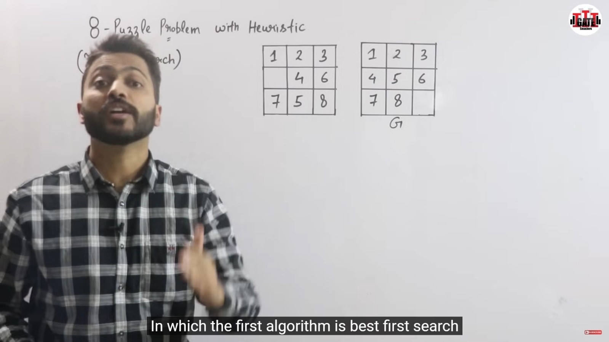
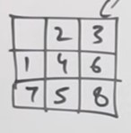
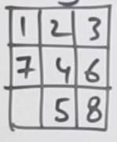
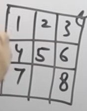

# 8-Puzzle Problem Heuristic Solution Summary

This document summarizes the algorithm for solving the 8-puzzle problem using heuristics, based on the legendary Indian instructor's lecture (Gate Smashers) for better understanding.

이 문서는 8-퍼즐 문제를 휴리스틱을 활용해 푸는 알고리즘을 정리한 것으로, 전설의 인도 아저씨(Gate Smashers) 강의를 참고하여 이해를 돕기 위해 작성되었습니다.

**Reference Video:** [Lec-9: How to Solve 8-Puzzle Problem with Heuristic(Informed Search) in Artificial Intelligence | Gate Smashers](https://youtu.be/nmWGhb9E4es?si=ztbBGhFPltxcL1Ht)

# 8-퍼즐 문제 휴리스틱 풀이 정리

수업 내용이 어려워서, 전설의 인도 아저씨(Gate Smashers) 강의를 참고하여 알고리즘을 이해하고 정리한 문서입니다.

**참고 영상:** [Lec-9: How to Solve 8-Puzzle Problem with Heuristic(Informed Search) in Artificial Intelligence | Gate Smashers](https://youtu.be/nmWGhb9E4es?si=ztbBGhFPltxcL1Ht)

### 1. Mismatched Count  
현재 퍼즐 상태에서 목표 상태와 다른 위치에 있는 타일의 개수를 계산합니다.  
예를 들어, 목표 상태가

| 1 | 2 | 3 |
|---|---|---|
|   | 4 | 6 |
| 7 | 5 | 8 |

에서 Misplace된 값인 R은
[4], [5], [8]로 총 3개이므로,
R = 3{4, 5, 8이 Goal과 다른 상황}

### 2. 빈칸이 움직일 수 있는 부분에 대해서 계산
위 상황에서 공백이 있는 칸을 기준으로 상, 하, 우 3방향으로 이동 가능한 상황(공백을 움직인다고 생각함)

---

### 3. 상, 하, 우 이동 시 예상 결과
**경우의 수 1: UP. 상 방향 이동 시**

|   | 2 | 3 |
|---|---|---|
| 1 | 4 | 6 |
| 7 | 5 | 8 |

---

**경우의 수 2: DOWN. 하 방향 이동 시**

| 1 | 2 | 3 |
|---|---|---|
| 7 | 4 | 6 |
|   | 5 | 8 |

---

**경우의 수 3: RIGHT. 우 방향 이동 시**

| 1 | 2 | 3 |
|---|---|---|
| 4 |   | 6 |
| 7 | 5 | 8 |

---

### 4. 휴리스틱(오차 개수) 계산
각 이동 결과에 대해 휴리스틱(오차 개수)을 계산하면, 가장 빠른 경로를 선택할 수 있다.
아래에서 각 방향별 휴리스틱 값을 직접 계산해보겠다.

**[UP. 상 방향 이동 시]: misplaced된 값의 개수: 4(공백은 세지 않는다)**

|   | 2 | 3 |
|---|---|---|
| 1 | 4 | 6 |
| 7 | 5 | 8 |

---

**[DOWN. 하 방향 이동 시]: misplaced된 값의 개수: 4**

| 1 | 2 | 3 |
|---|---|---|
| 7 | 4 | 6 |
|   | 5 | 8 |

---

**[RGIHT. 우 방향 이동 시]: misplaced된 값의 개수: 2[가장 작은 값] – 휴리스틱 결과[2]**
휴리스틱이 작다는 것은 가장 빠른 길이라는 의미이다.

| 1 | 2 | 3 |
|---|---|---|
| 4 |   | 6 |
| 7 | 5 | 8 |

### 5. 휴리스틱(오차 개수) 중 가장 값이 적은 RIGHT. 우 방향 이동을 선택

---

### 6. 이동 후 빈칸을 기준으로 이동 가능한 경우의 수 확인(4 방향)

**경우의 수 1: DOWN. 하 방향 이동 시(휴리스틱: 1)**

| 1 | 2 | 3 |
|---|---|---|
| 4 | 5 | 6 |
| 7 |   | 8 |

---

**경우의 수 2: RIGHT. 우 방향 이동 시(휴리스틱: 3)**

| 1 | 2 | 3 |
|---|---|---|
| 4 |   | 6 |
| 7 | 5 | 8 |

---

**경우의 수 3: LEFT. 좌 방향 이동 시(휴리스틱: 3)**

| 1 | 2 | 3 |
|---|---|---|
| 4 |   | 6 |
| 7 | 5 | 8 |

---

**경우의 수 4: UP. 상 방향 이동 시(휴리스틱: 3)**

| 1 |   | 3 |
|---|---|---|
| 4 | 2 | 6 |
| 7 | 5 | 8 |

---

### 7. 빈 칸의 이동 가능 경로 확인 및 휴리스틱 기반 최적 경로 반복 선택
각 단계마다 빈 칸이 이동할 수 있는 모든 경로를 확인하고, 각 경로에 대해 휴리스틱 값을 계산합니다. 휴리스틱 값이 가장 작은 경로를 선택하는 과정을 반복하여 최적의 해를 찾아갑니다.